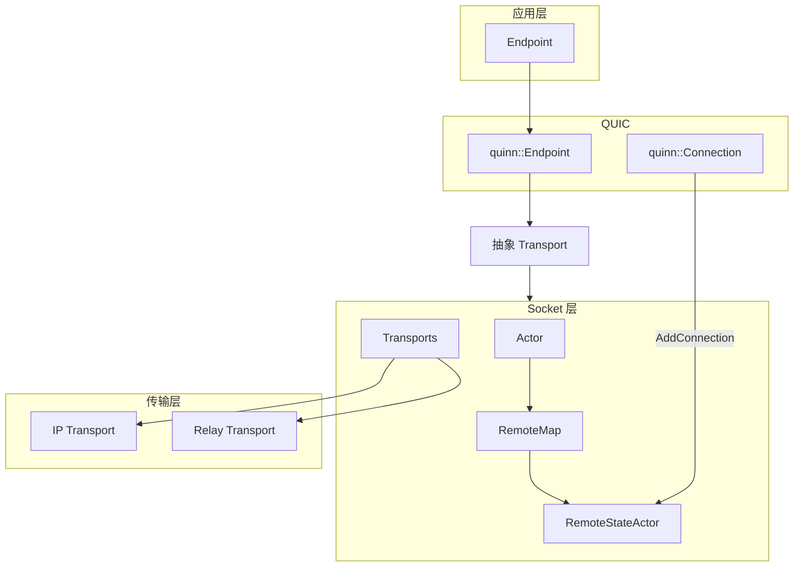

# Iroh P2P 打洞全流程解析

本文档基于 `third_party/iroh` 源码，解析项目中的 P2P 打洞完整流程。

---

## 一、整体架构



- **Endpoint**: 应用主入口，负责连接与 accept
- **Socket**: 负责路由、Relay、打洞调度
- **RemoteStateActor**: 每个远端 EndpointId 一个，负责打洞、路径选择、路径管理
- **Transports**: IP 直连 + Relay 转发，可并存

---

## 二、打洞流程概览

```mermaid
sequenceDiagram
    participant A as Peer A
    participant R as Relay Server
    participant B as Peer B

    Note over A,B: Phase 1 - 初始连接 via Relay
    A->>R: 1. HTTP+TLS 连接
    B->>R: 1. HTTP+TLS 连接
    A->>R: 2. QUIC 握手 (经 Relay 转发)
    R->>B: 2. 转发 QUIC 包
    A<->R<->B: 3. QUIC 连接建立

    Note over A,B: Phase 2 - 地址交换 (QUIC NAT Traversal 扩展)
    A->>B: 4. OBSERVED_ADDRESS / 本地地址 (经 Relay)
    B->>A: 4. OBSERVED_ADDRESS / 本地地址 (经 Relay)

    Note over A,B: Phase 3 - 打洞执行
    A->>RSA: 5. trigger_holepunching
    RSA->>Quinn: 6. initiate_nat_traversal_round
    Quinn->>B: 7. 向 B 的候选地址发送 QUIC Initial/Probe
    B->>A: 8. 向 A 的候选地址发送 QUIC Initial/Probe

    Note over A,B: Phase 4 - 直连成功
    A<-->B: 9. 直连 QUIC Path 建立
    RSA->>RSA: 10. select_path 切换到直连
```

---

## 三、详细流程分解

### 3.1 Phase 1: 初始连接建立（经 Relay）

**入口**: `Endpoint::connect(addr, alpn)`

1. **地址解析**
   - `addr` 通常为 `RelayUrl + EndpointId`（如 `relay://...?id=xxx`）
   - 或通过 Address Lookup（DNS/pkarr/mDNS）解析 Relay 和直连地址

2. **Transport 选择**
   - Socket 通过 `transports::Addr` 选择路径：`Relay(relay_url, endpoint_id)` 或 `Ip(socket_addr)`
   - 首次连接一般为 Relay 地址

3. **QUIC 连接**
   - Quinn 通过自定义 `Transport` 收发 UDP
   - `Transport::poll_recv` / `Transport::poll_send` 将包交给 Socket
   - Socket 查 `selected_path`，发给 Relay 或 IP

4. **Relay 转发**
   - Relay Transport 经 HTTP/1.1 + TLS + WebSocket 连接 Relay
   - 协议：`ClientToRelayMsg::Datagrams { dst_endpoint_id, datagrams }`
   - Relay 转发到对端：`RelayToClientMsg::Datagrams { remote_endpoint_id, datagrams }`
   - 端到端 QUIC 包被透明转发，Relay 不解密

5. **连接注册**
   - Quinn 握手完成后，`conn_from_quinn_conn` 调用 `register_connection`
   - 发送 `ActorMessage::AddConnection(remote, conn, tx)` 到 Socket Actor
   - Actor 转发到 `RemoteMap::add_connection` → `RemoteStateMessage::AddConnection`

**关键文件**:
- `iroh/src/endpoint/connection.rs` - `conn_from_quinn_conn`, `register_connection`
- `iroh/src/socket.rs` - `register_connection`, Actor 消息处理
- `iroh-relay/src/protos/relay.rs` - Relay 协议定义

---

### 3.2 Phase 2: 地址交换

**RemoteStateActor::handle_msg_add_connection** (`remote_state.rs:495`)

1. **订阅 Quinn 事件**
   - `path_events`: 路径打开/关闭
   - `nat_traversal_updates`: 远端 NAT 地址更新
   - `addr_events` = `conn.nat_traversal_updates()` 的 BroadcastStream

2. **本地地址上报**
   - `Self::set_local_addrs(&conn, &local_addrs)`
   - 调用 Quinn: `conn.add_nat_traversal_address(addr)`
   - 本地地址来自 `local_direct_addrs`（本地绑定 + QAD 反射地址）

3. **远端地址来源**
   - Quinn 的 QUIC NAT Traversal 扩展（draft-seemann-quic-nat-traversal）
   - 对端通过 `OBSERVED_ADDRESS` 等帧通告地址
   - 经当前 QUIC 连接（可能仍是 Relay）传输
   - `conn.get_remote_nat_traversal_addresses()` 返回远端候选地址

4. **QAD（QUIC Address Discovery）**
   - 独立于 Relay 的 QUIC 服务
   - 客户端连 Relay 的 QAD 端点，Relay 返回 observed address
   - 用于获取本地公网地址（`DirectAddrType::Qad4` 等）

**关键文件**:
- `iroh/src/socket/remote_map/remote_state.rs` - `handle_msg_add_connection`, `set_local_addrs`
- `iroh/src/endpoint/quic.rs` - `set_max_remote_nat_traversal_addresses`, `send_observed_address_reports`
- `iroh/src/net_report/` - QAD 探测逻辑

---

### 3.3 Phase 3: 打洞触发

**触发条件** (`remote_state.rs:286-336`):

| 触发源 | 说明 |
|--------|------|
| `addr_events` | 远端 NAT 地址更新 |
| `local_direct_addrs.updated()` | 本地地址更新 |
| `AddConnection` | 新连接加入 |
| `scheduled_holepunch` | 上次失败后 100ms 重试，或 5s 周期 |
| `check_connections` (UPGRADE_INTERVAL 60s) | 定期检查路径质量 |
| `handle_network_change` (is_major) | 网络大变 |

**trigger_holepunching 逻辑** (`remote_state.rs:707`)

1. 选用于打洞的连接：取 ConnId 最小的 **client** 连接
2. 获取远端候选：`conn.get_remote_nat_traversal_addresses()`
3. 获取本地候选：`local_direct_addrs.get()`
4. 防抖：
   - 候选无变化且距上次尝试 < 5s 时，调度 `scheduled_holepunch`，不立即打洞
   - 有新候选则立即打洞

**do_holepunching 逻辑** (`remote_state.rs:768`)

1. 调用 Quinn: `conn.initiate_nat_traversal_round()`
2. Quinn 通过 `iroh_hp`（quinn_proto 扩展）向 (local × remote) 地址对发送 NAT 探测包
3. 成功后记录 `last_holepunch`
4. 失败则：
   - `ExtensionNotNegotiated` 等致命错误：不重试
   - `Multipath` / `NotEnoughAddresses`：100ms 后 `scheduled_holepunch` 重试

**关键常量**:
- `HOLEPUNCH_ATTEMPTS_INTERVAL`: 5s（`remote_state.rs:57`）
- `MAX_MULTIPATH_PATHS`: 12（`socket.rs:105`）

---

### 3.4 Phase 4: 路径打开与选择

**handle_path_event**  
- 收到 Quinn `PathEvent`（路径 validated、closed 等）
- 更新 `paths`、`open_paths`
- 调用 `select_path()`

**select_path** (`remote_state.rs:1020`)

1. 收集所有路径的 RTT 和 status
2. `select_best_path()`：
   - 优先 `PathStatus::Available` > `Backup`
   - 同一 status 下选 RTT 更低
   - IPv6 有约 3ms 的 RTT 偏好
3. 若选中新路径：
   - `selected_path.set(Some(addr))`
   - `open_path(&addr)`：确保路径在其它 connection 上打开
   - `close_redundant_paths(&addr)`：关闭多余的直连路径（保留至少 1 条）

**open_path** (`remote_state.rs:823`)

- 对每个 client 连接调用 `conn.open_path_ensure(quic_addr, path_status)`
- 对应 Quinn multipath：向新地址发起路径建立
- 若 `RemoteCidsExhausted`，加入 `pending_open_paths`，333ms 后重试

---

## 四、数据流与关键结构

### 4.1 包发送路径

```
应用写数据 → Quinn Connection
    → Quinn 选择 path (基于 multipath)
    → Transport::poll_send (Socket)
    → RemoteStateActor::handle_msg_send_datagram
    → 查 selected_path
    → 若选中 Relay：Relay Sender
    → 若选中 IP：直接 UDP send
```

### 4.2 包接收路径

```
UDP recv (IP 或 Relay) 
    → Transport::poll_recv
    → Quinn 解析 QUIC 包
    → 新连接 / 已有连接
    → PathEvent / nat_traversal_updates
    → RemoteStateActor 处理
```

### 4.3 关键结构

| 结构 | 位置 | 作用 |
|------|------|------|
| `RemoteStateActor` | `remote_state.rs:125` | 管理单远端所有连接、打洞、路径 |
| `RemoteStateMessage` | `remote_state.rs:1204` | AddConnection, ResolveRemote, SendDatagram |
| `HolepunchAttempt` | `remote_state.rs:1240` | 记录上次打洞的 local/remote 候选 |
| `transports::Addr` | `transports.rs` | `Ip(SocketAddr)` 或 `Relay(RelayUrl, EndpointId)` |

---

## 五、与 Quinn / iroh-quinn 的配合

- 使用 **iroh-quinn** 分支（`Cargo.toml` patch）
- Quinn 内置：
  - NAT Traversal 扩展（地址交换）
  - Multipath（多路径、路径打开）
- `quinn_proto::iroh_hp` 负责具体打洞报文和状态机
- `initiate_nat_traversal_round` 和 `get_remote_nat_traversal_addresses` 是 Quinn Connection 的 API

---

## 六、流程小结

1. **先连 Relay**：QUIC 经 Relay 建立，数据可立刻传输。
2. **地址交换**：通过 QUIC NAT Traversal 扩展在现有连接上交换 local/remote 候选。
3. **打洞调度**：RemoteStateActor 在连接注册、地址更新、定时器、网络变化时触发打洞。
4. **执行打洞**：Quinn 向 (local × remote) 地址对发送探测包。
5. **路径选择**：打洞成功后 multipath 建立新 path，`select_path` 切到最优直连路径。
6. **Relay 保底**：打洞失败时继续走 Relay，连接不中断。

---

## 七、相关源码索引

| 功能 | 文件:行号 |
|------|-----------|
| 打洞触发 | `remote_state.rs:302-329, 404, 440` |
| trigger_holepunching | `remote_state.rs:707` |
| do_holepunching | `remote_state.rs:768` |
| AddConnection 处理 | `remote_state.rs:495` |
| select_path | `remote_state.rs:1020` |
| open_path | `remote_state.rs:823` |
| 连接注册 | `endpoint/connection.rs:250`, `socket.rs:1172` |
| Relay 协议 | `iroh-relay/src/protos/relay.rs` |
